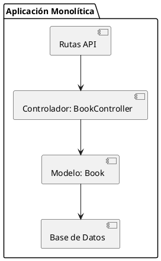

# Documentación Técnica: Implementación Monolítica
## 1. Introducción
Esta documentación describe la implementación monolítica de la funcionalidad clave del sistema desarrollado en el Primer Parcial. La funcionalidad seleccionada es la **gestión de libros**, que incluye operaciones CRUD y acciones específicas como "prestar" y "devolver" libros.
## 2. Descripción de la Funcionalidad
La funcionalidad permite:
- Listar todos los libros.
- Ver detalles de un libro específico.
- Crear, actualizar y eliminar libros.
- Marcar un libro como prestado.
- Registrar la devolución de un libro.
### Rutas Definidas
Las rutas están definidas en el archivo `routes/api.php`:
```php
Route::get('/books', [BookController::class, 'index']);
Route::get('/books/{id}', [BookController::class, 'show']);
Route::post('/books', [BookController::class, 'store']);
Route::put('/books/{id}', [BookController::class, 'update']);
Route::delete('/books/{id}', [BookController::class, 'destroy']);
Route::patch('/books/{id}/borrow', [BookController::class, 'borrow']);
Route::patch('/books/{id}/return', [BookController::class, 'return']);
```
## 3. Arquitectura
La implementación sigue el patrón **Modelo-Vista-Controlador (MVC)**, característico de Laravel.
### Diagrama de Arquitectura

### Componentes Principales
- **Controlador (`BookController`)**: Maneja las solicitudes HTTP y coordina la lógica de negocio.
- **Modelo (`Book`)**: Representa la entidad "Libro" y gestiona la interacción con la base de datos.
- **Base de Datos**: Almacena la información de los libros.
## 4. Ejecución Local
### Requisitos
- PHP 8.1 o superior.
- Composer.
- Base de datos MySQL o SQLite.
### Pasos para Ejecutar
1. Clonar el repositorio:
   ```bash
   git clone https://github.com/alexisirala/Hexagonal-library.git
   cd Hexagonal-library
   ```
2. Instalar dependencias:
   ```bash
   composer install
   ```
3. Configurar el archivo `.env`:
   ```env
   DB_CONNECTION=sqlite
   DB_DATABASE=/ruta/a/database.sqlite
   ```
4. Ejecutar migraciones:
   ```bash
   php artisan migrate
   ```
5. Iniciar el servidor:
   ```bash
   php artisan serve
   ```
6. Acceder a la aplicación en `http://localhost:8000`.
## 5. Pruebas
Se han implementado pruebas funcionales en la carpeta `tests/Feature` para validar las operaciones CRUD y las acciones específicas de "prestar" y "devolver" libros.
### Ejecución de Pruebas
```bash
php artisan test
```
## 6. Capturas de Pantalla
### Listado de Libros

### Detalle de un Libro

## 7. Conclusión
La implementación monolítica cumple con los requisitos establecidos, proporcionando una funcionalidad completa y modularizada para la gestión de libros. La estructura MVC asegura claridad y mantenibilidad del código.

La implementación monolítica cumple con los requisitos establecidos, proporcionando una funcionalidad completa y modularizada para la gestión de libros. La estructura MVC asegura claridad y mantenibilidad del código.

## 7. Conclusión


### Detalle de un Libro


### Listado de Libros

## 6. Capturas de Pantalla

```md
php artisan test
```bash

Se han implementado pruebas funcionales en la carpeta `tests/Feature` para validar las operaciones CRUD y las acciones específicas de "prestar" y "devolver" libros.
## 5. Pruebas

6. Acceder a la aplicación en `http://localhost:8000`.
```

php artisan serve

```bash
5. Iniciar el servidor:
```

php artisan migrate

```bash
4. Ejecutar migraciones:
```

DB_DATABASE=/ruta/a/database.sqlite
DB_CONNECTION=sqlite

```env
3. Configurar el archivo `.env`:
```

composer install

```bash
2. Instalar dependencias:
```

cd Hexagonal-library
git clone https://github.com/alexisirala/Hexagonal-library.git

```bash
1. Clonar el repositorio:

- Base de datos MySQL o SQLite.
- Composer.
- PHP 8.1 o superior.
## 4. Ejecución Local

- **Base de Datos**: Almacena la información de los libros.
- **Modelo (`Book`)**: Representa la entidad "Libro" y gestiona la interacción con la base de datos.
- **Controlador (`BookController`)**: Maneja las solicitudes HTTP y coordina la lógica de negocio.

```

@enduml
}
[Modelo: Book] --> [Base de Datos]
[Controlador: BookController] --> [Modelo: Book]
[Rutas API] --> [Controlador: BookController]
package "Aplicación Monolítica" {
@startuml

```plantuml

La implementación sigue el patrón **Modelo-Vista-Controlador (MVC)**, característico de Laravel.
## 3. Arquitectura

```

Route::patch('/books/{id}/return', [BookController::class, 'return']);
Route::patch('/books/{id}/borrow', [BookController::class, 'borrow']);
Route::delete('/books/{id}', [BookController::class, 'destroy']);
Route::put('/books/{id}', [BookController::class, 'update']);
Route::post('/books', [BookController::class, 'store']);
Route::get('/books/{id}', [BookController::class, 'show']);
Route::get('/books', [BookController::class, 'index']);

```php
Las rutas están definidas en el archivo `routes/api.php`:

- Registrar la devolución de un libro.
- Marcar un libro como prestado.
- Crear, actualizar y eliminar libros.
- Ver detalles de un libro específico.
- Listar todos los libros.
La funcionalidad permite:
## 2. Descripción de la Funcionalidad

Esta documentación describe la implementación monolítica de la funcionalidad clave del sistema desarrollado en el Primer Parcial. La funcionalidad seleccionada es la **gestión de libros**, que incluye operaciones CRUD y acciones específicas como "prestar" y "devolver" libros.
## 1. Introducción
 Documentación Técnica: Implementación Monolítica
```